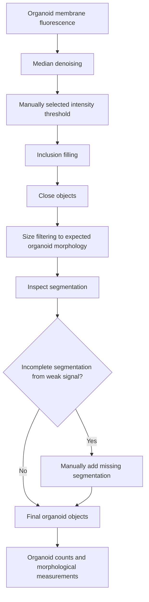

# Organoid morphology segmentation

```mermaid
flowchart TD
 A[Organoid membrane fluorescence] --> B[Median denoising]
 B --> C[Manually selected intensity threshold]
 C --> D[Inclusion filling]
 D --> E[Close objects]
 E --> F[Size filtering to expected organoid morphology]
 F --> G[Inspect segmentation]
 G --> H{Incomplete segmentation from weak signal?}
 H -->|Yes| I[Manually add missing segmentation]
 H -->|No| J[Final organoid objects]
 I --> J
 J --> K[Organoid counts and morphological measurements]
```
