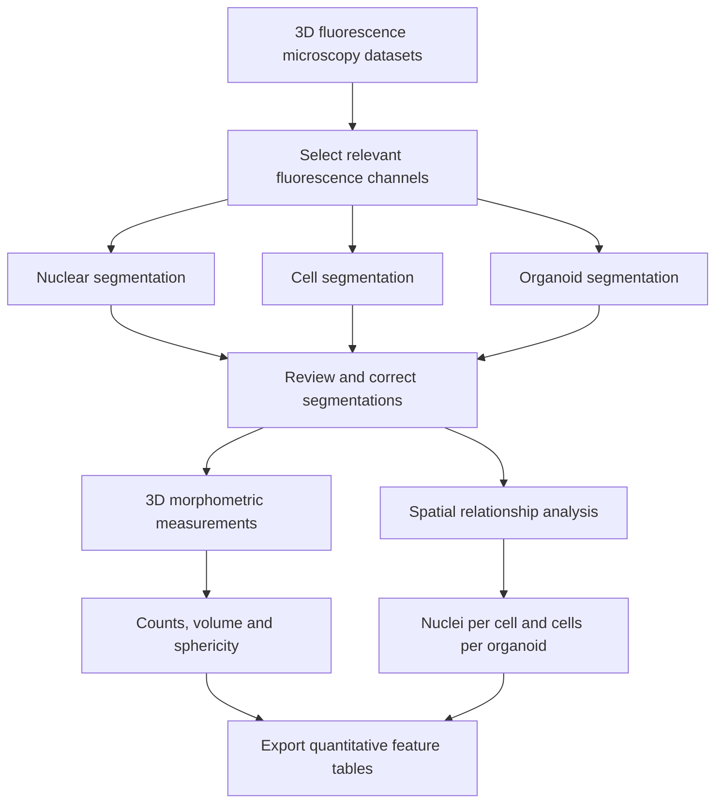

# Overall image-analysis architecture

```mermaid
flowchart TD
 A[3D fluorescence microscopy datasets] --> B[Select relevant fluorescence channels]
 B --> C[Nuclear segmentation]
 B --> D[Cell segmentation]
 B --> E[Organoid segmentation]
 C --> F[Review and correct segmentations]
 D --> F
 E --> F
 F --> G[3D morphometric measurements]
 F --> H[Spatial relationship analysis]
 G --> I[Counts, volume and sphericity]
 H --> J[Nuclei per cell and cells per organoid]
 I --> K[Export quantitative feature tables]
 J --> K
```

This summarizes the contributed analysis components; it does not imply that temporal tracking or F-actin skeleton analysis was implemented.
